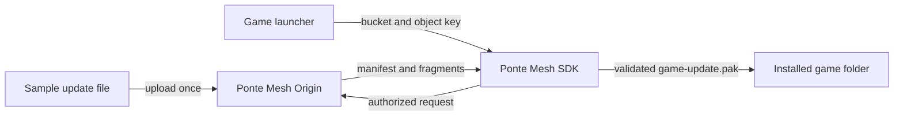

# Ponte Mesh Game Launcher Example

A small, cross-platform game launcher that downloads a fake game update from a local Ponte Mesh Origin through the real Ponte Mesh SDK.

This repository is the shortest complete path from an empty machine to an application-managed download. It uses one Rust SDK call and keeps manifest handling, fragment validation, source selection, and fallback inside Ponte Mesh.

## What you will run



- Docker Compose runs a Ponte Mesh Origin and PostgreSQL.
- The Server panel creates the bucket, stores the sample update, and issues the launcher credential.
- The Rust application calls `pontemesh-sdk-core` and displays download progress plus the transfer source summary.

## Requirements

- Docker Desktop or Docker Engine with Docker Compose
- Rust installed through [rustup](https://rustup.rs/)
- Git

The same source code runs on Windows, Linux, and macOS.

## Quick start

### 1. Start the local Origin

```bash
docker compose up --build -d
```

The first build compiles the pinned Ponte Mesh Server revision and can take several minutes. The Compose image builds the administration panel and Server runtime; the Server and launcher test suites are run separately from the runtime image.

Read the one-time setup token:

```bash
docker compose exec origin cat /var/pontemesh_home/secrets/initialAdminToken
```

Open [http://localhost:8080](http://localhost:8080), paste the token, and complete setup with the **Origin** role.

### 2. Publish the sample update

In the Server panel:

1. Open **Buckets** and create `game-updates`.
2. Open that bucket and upload `sample-content/game-update.pak`.
3. Set its object key to `releases/1.0.0/game-update.pak`.
4. Open **Settings**, create an application credential named `game-launcher-example`, and copy the token shown once.

### 3. Configure the launcher

Copy `launcher.example.toml` to `launcher.toml`, then replace the placeholder application token with the token from the Server panel.

For a launcher running on another device in the same LAN, replace `127.0.0.1` with the Docker host's LAN address.

`launcher.toml` is ignored by Git so the token is not committed. The environment variables `PONTEMESH_ORIGIN_URL` and `PONTEMESH_APPLICATION_TOKEN` can override those two values when needed. `PONTEMESH_CONFIG` can point to a different configuration file.

### 4. Download the update

```bash
cargo run --release
```

The completed update appears at `installed-game/game-update.pak`. The launcher prints how many bytes came from the Origin, Replica/Edge nodes, and peers, then reports `READY TO PLAY`.

## Why the basic example uses only the Origin

The launcher already uses the complete SDK flow. With no Replica/Edge or peer available, the Origin is the authorized source and guaranteed fallback. Adding auxiliary sources later does not change the application-level download call.

See [How the example works](docs/HOW_IT_WORKS.md) for the sequence diagram, trust boundaries, code map, and next production steps.

## Stop or reset the example

Stop the containers while keeping the local data:

```bash
docker compose down
```

To start over completely, remove the containers and their named volumes:

```bash
docker compose down --volumes
```

The second command permanently removes the example's local Server state, stored objects, credentials, and database.

## Troubleshooting

- **The launcher cannot connect:** confirm the Server panel opens at the configured `origin_url` and that port `8080` is allowed through the Docker host firewall.
- **Access denied:** create a new application credential and update `launcher.toml`; do not use the administrator setup token or an S3 key.
- **Object not found:** verify both `game-updates` and `releases/1.0.0/game-update.pak` in the Server panel.
- **Docker port conflict:** stop the process using ports `8080` or `9000`, or change both the Compose port mapping and the launcher Origin URL.

## Project links

- [Ponte Mesh documentation](https://fhfelipefh.github.io/pontemesh-docs/)
- [Ponte Mesh Server](https://github.com/fhfelipefh/pontemesh-server)
- [Ponte Mesh SDK](https://github.com/fhfelipefh/pontemesh-sdk)

## License

Licensed under the Apache License 2.0.
