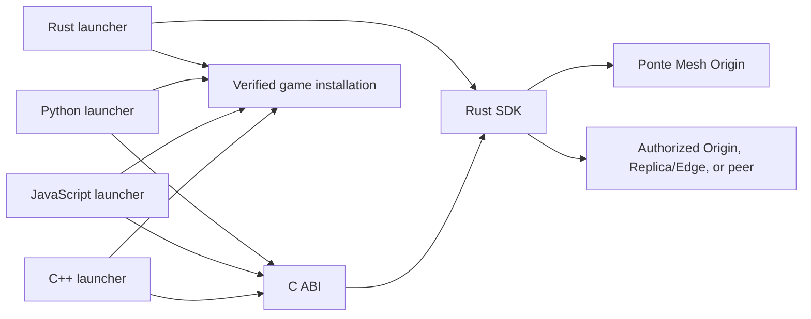

# Ponte Mesh Game Launcher Examples

Functional, beginner-friendly game launcher examples that download the same release
from a local Ponte Mesh network through different language stacks.

| Example | SDK bridge | Install directory |
| --- | --- | --- |
| [Rust (CLI)](examples/rust/) | Native Rust SDK | `runtime/installations/rust/` |
| [Rust (Visual Launcher)](examples/rust-ui/) | Native Rust SDK + egui UI | `runtime/installations/rust/` |
| [Python](examples/python/) | Standard-library `ctypes` over the C ABI | `runtime/installations/python/` |
| [JavaScript](examples/javascript/) | Koffi over the C ABI | `runtime/installations/javascript/` |
| [C++](examples/cpp/) | Dynamically loaded C ABI with RAII | `runtime/installations/cpp/` |

The Python, JavaScript, and C++ code are language bindings around the official
native SDK. They do not reimplement authorization, source selection, fragment
validation, peer transport, or Origin fallback.



## What every example demonstrates

- release discovery through `releases/stable.json`;
- ordered multi-file installation;
- safe relative paths and bounded release descriptors;
- SDK-managed access packages, source selection, fragment hashes, and fallback;
- progress reporting and source statistics;
- staged replacement with rollback;
- separate ignored runtime output for each language.

The Rust example additionally demonstrates the SDK's persistent fragment cache and
optional LAN peer seeding APIs.

## Requirements

- Docker Desktop or Docker Engine with Docker Compose;
- Rust installed through [rustup](https://rustup.rs/), used by the shared bootstrap;
- a Ponte Mesh SDK native package or a sibling `pontemesh-sdk` checkout;
- the runtime for the selected example:
  - Python 3.11 or newer;
  - Node.js 20 or newer;
  - a C++17 compiler and CMake 3.20 or newer.

The examples target Windows, Linux, and macOS. Platform-specific application stacks
are intentionally outside the current scope.

## Prepare the shared local network

Start the local Origin and PostgreSQL:

```bash
docker compose up --build -d
```

Create the bucket, peer-enabled policy, 8 MiB game package, release descriptor, and
ignored local credentials:

```bash
cargo run --locked --manifest-path examples/rust/Cargo.toml --bin bootstrap
```

The generated package is uploaded from a temporary file and is never committed to
Git. All credentials, downloads, caches, builds, and installations remain under
ignored paths.

## Provide the native SDK

Extract an official SDK release into `native/`, preserving the dynamic library and
`include/pontemesh_sdk.h`. Alternatively, build a sibling SDK checkout:

```bash
cargo build --release --manifest-path ../pontemesh-sdk/bindings/c/Cargo.toml
```

If the library is elsewhere, set `PONTEMESH_SDK_LIBRARY` to its absolute path. Rust
uses the SDK source dependency directly and does not need this environment variable.

## Run an example

Rust (CLI):
 
```bash
cargo run --release --locked --manifest-path examples/rust/Cargo.toml
```

Rust (Visual Launcher):

```bash
cargo run --release --manifest-path examples/rust-ui/Cargo.toml
```

Python:

```bash
python examples/python/launcher.py
```

JavaScript:

```bash
cd examples/javascript
npm install
npm start
```

C++:

```bash
cmake -S examples/cpp -B examples/cpp/build
cmake --build examples/cpp/build --config Release
```

Run the generated `pontemesh_game_launcher_cpp` from the repository root.

## Local-network addresses

The bootstrap writes `http://127.0.0.1:8080` to `launcher.toml`. On another computer
in the same trusted network, replace it with the Origin machine's LAN address, such
as `http://192.168.1.50:8080`, and copy the downloader token securely. HTTP and HTTPS
are both supported; HTTP should be limited to a network you trust and control.

## Stop or reset

Keep Server state:

```bash
docker compose down
```

Delete only the demonstration Server volumes:

```bash
docker compose down --volumes
```

## Documentation

- [How all examples work](docs/HOW_IT_WORKS.md)
- [Security policy](SECURITY.md)
- [Ponte Mesh SDK language bindings](https://github.com/fhfelipefh/pontemesh-sdk/blob/main/docs/LANGUAGE_BINDINGS.md)

## Project links

- [Ponte Mesh documentation](https://fhfelipefh.github.io/pontemesh-docs/)
- [Ponte Mesh Server](https://github.com/fhfelipefh/pontemesh-server)
- [Ponte Mesh SDK](https://github.com/fhfelipefh/pontemesh-sdk)
- [Game Launcher Examples](https://github.com/fhfelipefh/pontemesh-game-launcher-example)

## License

Licensed under the Apache License 2.0.
