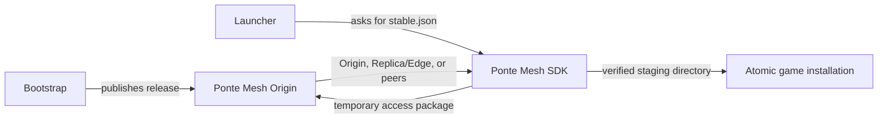

# Ponte Mesh Game Launcher Example

A small cross-platform launcher that discovers and installs a multi-file game release
from a local Ponte Mesh network. It uses the real Server and Rust SDK while keeping
the application code approachable for first-time users.



## Included behavior

- automatic latest-version discovery through `releases/stable.json`;
- ordered, multi-file release installation;
- fragment and release-level SHA-256 validation;
- persistent fragment cache and cross-process resume;
- total object progress and source statistics;
- bounded release descriptors, cache-aware disk preflight, staging, atomic replacement, and rollback;
- optional LAN peer seeding;
- a least-privilege downloader credential created by the bootstrap command.

## Requirements

- Docker Desktop or Docker Engine with Docker Compose
- Rust installed through [rustup](https://rustup.rs/)
- Git

The same Rust source runs on Windows, Linux, and macOS.

## Quick start

Start the local Origin and PostgreSQL:

```bash
docker compose up --build -d
```

Prepare the Origin, bucket, peer-enabled policy, sample release, and ignored local
launcher credentials. The command generates a unique administrative password under
the ignored `runtime/` directory:

```bash
cargo run --bin bootstrap
```

Install the latest release:

```bash
cargo run --release
```

The installed release appears in `runtime/installed-game/game/`, and its discovered
version is stored in `runtime/installed-game/.pontemesh-version`. The entire
`runtime/` directory is ignored by Git.

## Release format

The bootstrap generates an 8 MiB package in a temporary file, publishes it with two
small sample files, and uploads this descriptor as `game-updates/releases/stable.json`.
The generated package is never stored in Git:

```json
{
  "schemaVersion": 1,
  "product": "pontemesh-demo-game",
  "version": "1.0.0",
  "files": [
    {
      "bucket": "game-updates",
      "key": "releases/1.0.0/game/game-update.pak",
      "path": "game/game-update.pak",
      "sizeBytes": 8388608,
      "sha256": "64 lowercase hexadecimal characters",
      "order": 10
    }
  ]
}
```

Paths are relative to the installation root. Absolute paths, parent traversal,
duplicates, invalid hashes, empty releases, and unsupported schemas are rejected by
the SDK before installation.

## Test two launchers over the LAN

Keep the first launcher alive as a peer by adding these values to its ignored
`launcher.toml`:

```toml
p2p_listen_address = "/ip4/0.0.0.0/tcp/41001"
p2p_announce_address = "/ip4/192.168.1.50/tcp/41001"
seed_seconds = 300
```

Replace the address with that machine's LAN IP, run the launcher, and then run a
second configured launcher while the first is seeding. The transfer summary shows
bytes received from peers. Every peer fragment is still validated against the
Origin-authorized manifest.

The Compose Origin is reachable from the local network by default. On another
launcher, set `origin_url` to the Server machine's LAN address, such as
`http://192.168.1.50:8080`. HTTP and HTTPS are both supported; use this HTTP setup
only on a network you trust and control.

## Failure and resume checks

Interrupt a download or make an auxiliary source unavailable, then run the launcher
again. Validated fragments remain under `.pontemesh-cache` beside the target and are
revalidated before reuse. Source failure activates the package-defined fallback;
the SDK does not discard completed fragments.

The Server repository's Origin/Replica integration suite exercises Replica/Edge
loss and Origin fallback with the same contracts used here:

```bash
npm --prefix ../pontemesh-server/web run test:e2e:origin-replica
```

## Credentials

`bootstrap` writes the downloader token to the ignored `launcher.toml` and stores a
random 48-character administrative password in
`runtime/bootstrap-admin-password`. On Unix, both files are created with owner-only
permissions; on Windows, they inherit the current user's filesystem access control.
`PONTEMESH_APPLICATION_TOKEN` and `PONTEMESH_ORIGIN_URL` can override local values.
Never commit or compile a reusable token into a public launcher. Protected game
content should use user authentication and a backend token exchange; see
[Security](SECURITY.md).

## Stop or reset

Keep local data:

```bash
docker compose down
```

Delete the demonstration Server state, credentials, database, and objects:

```bash
docker compose down --volumes
```

## More detail

Read [How it works](docs/HOW_IT_WORKS.md) for the control/data flow and code map.

## Project links

- [Ponte Mesh documentation](https://fhfelipefh.github.io/pontemesh-docs/)
- [Ponte Mesh Server](https://github.com/fhfelipefh/pontemesh-server)
- [Ponte Mesh SDK](https://github.com/fhfelipefh/pontemesh-sdk)

## License

Licensed under the Apache License 2.0.
