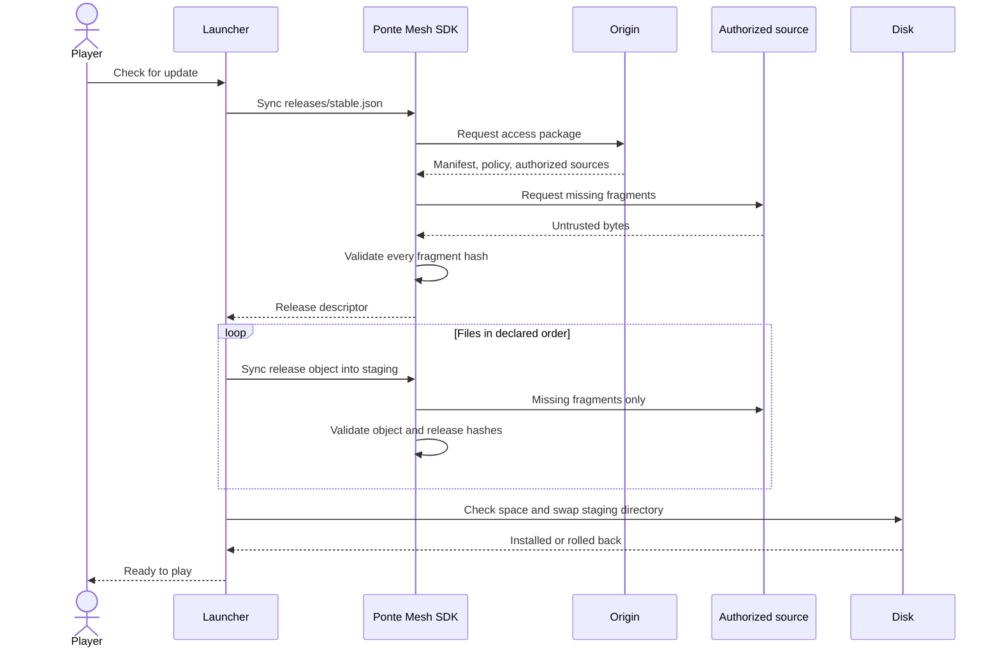
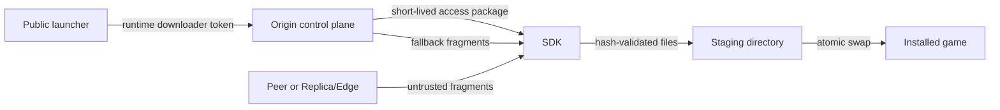
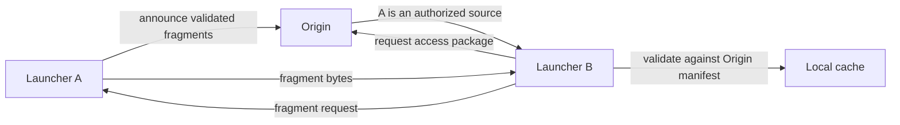

# How the example works

The launcher knows the Origin URL, a runtime-injected downloader token, the release
bucket, the stable descriptor key, and the installation directory. Ponte Mesh owns
authorization, source selection, fragment validation, resume, and fallback.

## Update sequence



## Code map

```text
src/main.rs            starts a normal update
src/config.rs          loads local and environment configuration
src/launcher.rs        stages, verifies, installs, and rolls back releases
src/bin/bootstrap.rs   prepares a fresh local Origin automatically
compose.yaml           starts the Origin and PostgreSQL
sample-content/        contains small release metadata files
runtime/               ignored downloads, fragment cache, and installed game
```

The bootstrap creates the 8 MiB simulated game package in a temporary file. It is
uploaded to the local Origin and removed automatically instead of being committed to
the repository. It also creates a random administrative password and downloader token
inside ignored local files; no reusable application or Server credential is tracked.

## Trust boundaries



The downloader preset has no object-write scope. It limits a leaked demonstration
token but does not turn an embedded secret into a safe authentication mechanism.
Public protected applications need a real user identity and short-lived token
exchange outside the executable.

## Resume and rollback

Validated fragments are cached by manifest identity. A later process reads and
revalidates them before downloading anything. Completed files are written through a
temporary file. A release is assembled in a sibling staging directory, then the old
installation is renamed to a rollback directory before the new one is installed. If
the final rename fails, the previous directory is restored. Before downloading, the
launcher rejects releases above 20 GiB or 10,000 files and reserves disk space for
both the fragment cache and staging directory.

## LAN peer flow



Launcher A must remain running and advertise a reachable LAN address. The Origin
continues to control discovery and authorization; a peer never becomes the authority
for hashes or access.

The default Compose Origin is loopback-only. For launchers on separate computers,
publish the Origin through HTTPS and configure that URL on each launcher. Remote HTTP
URLs are rejected because they would expose the bearer token and trusted control-plane
responses to the network.
