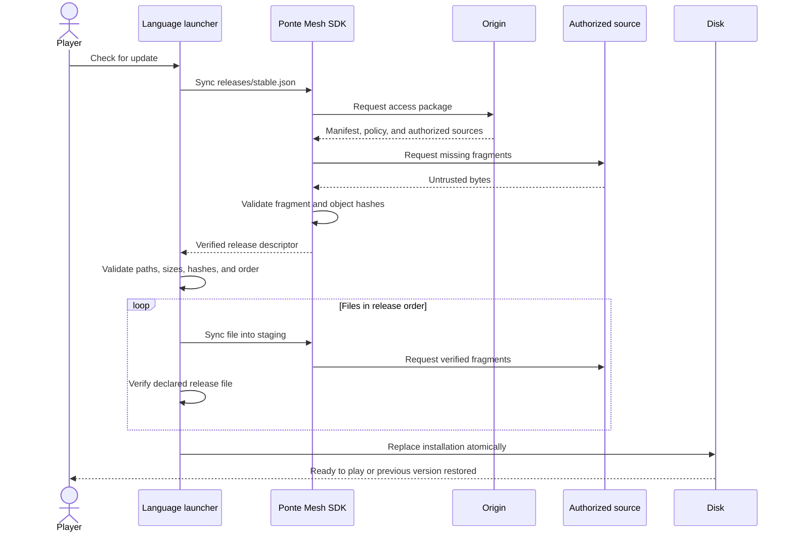
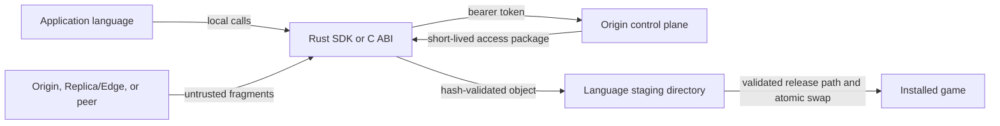

# How the examples work

Every language consumes the same `launcher.toml`, Origin, downloader credential, and
release descriptor. The only difference is how application code reaches the SDK.



## Repository map

```text
examples/rust/        direct Rust SDK and full cache/P2P features
examples/python/      ctypes wrapper over the stable C ABI
examples/javascript/  Koffi wrapper over the stable C ABI
examples/cpp/         C++17 dynamic loader and RAII client
docker/               shared local Origin image
sample-content/       small metadata files uploaded by bootstrap
runtime/              ignored credentials, downloads, and installations
native/               ignored extracted native SDK package
```

## Trust boundaries



Python `ctypes`, JavaScript Koffi, and the C++ dynamic loader are thin bridges. They
do not decide which source is trusted and do not validate network fragments; those
security controls remain inside the native SDK.

## Release validation

All implementations require schema version 1, a non-empty release, safe portable
relative paths, unique destinations, valid sizes, SHA-256-shaped digests, at most
10,000 files, and at most 20 GiB. Python and JavaScript additionally compare the
release-level SHA-256 after the SDK completes. C++ relies on the SDK's complete-object
hash validation and checks the descriptor size before installation.

## Installation isolation

Each stack installs into its own directory under `runtime/installations/`. A failed
final rename restores the previous directory. This lets all examples run against the
same release without overwriting one another.
