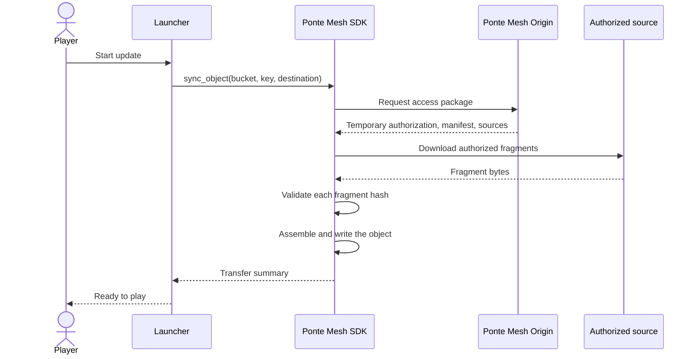
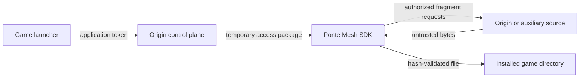

# How the example works

The launcher knows only five application-level values: the Origin URL, an application token, a bucket, an object key, and a destination path. It does not implement manifest parsing, fragment selection, integrity checks, source selection, or fallback.

## Update sequence



In this basic setup the Origin is the only available data source. That is valid Ponte Mesh behavior: the Origin is also the guaranteed fallback. Replica/Edge and peer sources can be introduced later without changing the launcher call.

## Code map

```text
src/main.rs       prints launcher state and coordinates one update
src/config.rs     loads and validates launcher.toml
src/launcher.rs   translates the launcher request into one SDK call
compose.yaml      starts a local Origin and PostgreSQL
sample-content/   contains the fake game update uploaded to the Origin
```

The integration itself is intentionally small:

```rust
let client = PontemeshClient::new(PontemeshClientConfig {
    origin_url,
    application_token,
    p2p: P2pConfig::default(),
})?;

client.sync_object_with_summary_and_progress(
    SyncObjectRequest {
        bucket,
        key,
        destination,
    },
    Some(&mut progress),
)?;
```

## Trust boundaries



The long-lived application token is used only to ask the Origin for a temporary access package. Fragment bytes are not trusted merely because they came from a known network address; the SDK validates them against the Origin-authorized manifest.

## Local-network behavior

`127.0.0.1` is appropriate when the launcher and Docker run on the same computer. For a launcher on another computer, use the Docker host's LAN address, for example `http://192.168.1.25:8080`, and allow inbound TCP port `8080` in the host firewall.

The database is not published to the host. Port `9000` is exposed for S3-compatible tools, while this launcher communicates with the Ponte Mesh endpoints on port `8080`.

## Moving beyond the example

A production launcher would normally add version discovery, signed launcher releases, retry UX, disk-space checks, atomic installation, rollback, and secure credential provisioning. Those concerns are deliberately outside this repository so the Ponte Mesh integration remains easy to read.
